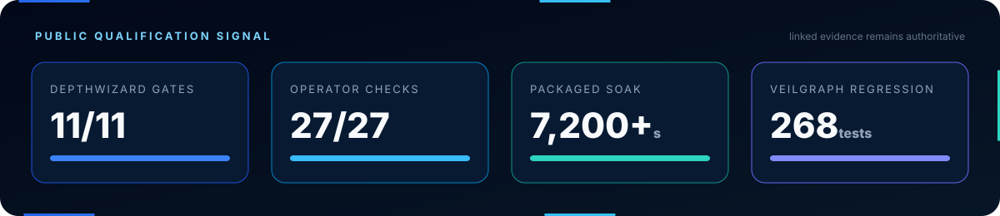
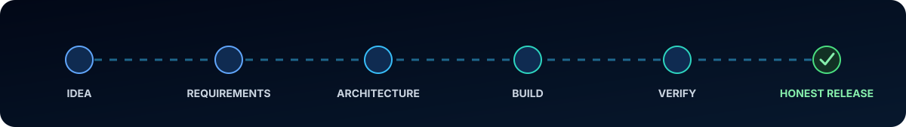

  

<h1 align="center">Amogh R Balakrishna</h1>

  <strong>I build ambitious AI systems—and the engineering proof that makes them trustworthy.</strong>

  
  
  

  <a href="https://github.com/amogh-hub/depthwizard"><strong>Earth observation</strong></a>
  &nbsp;·&nbsp;
  <a href="https://github.com/amogh-hub/VeilGraph"><strong>Privacy engineering</strong></a>
  &nbsp;·&nbsp;
  <a href="https://github.com/amogh-hub/Ai-operation-infrastructure"><strong>Governed AI</strong></a>
  &nbsp;·&nbsp;
  <a href="https://github.com/amogh-hub?tab=repositories"><strong>Product systems</strong></a>

  

## The builder behind the systems

I work where machine learning, scientific computing and product engineering meet. A model output is only the beginning: the result must be calibrated, governed, tested, traceable, deployable and understandable to the person using it.

My default is simple: **tell the truth at the system boundary**. I would rather lock an unsupported scientific, privacy or deployment claim than disguise uncertainty as confidence.

  

## Flagship systems

### 🛰️ [DepthWizard — Single-View Height Estimation and 3D Flythrough](https://github.com/amogh-hub/depthwizard)

One optical remote-sensing image becomes either a truthful relative DSM or an evidence-calibrated metric DSM—and then a textured, measurable, navigable 3D terrain.

`Python` · `PyTorch` · `Rasterio` · `FastAPI` · `React` · `Three.js` · `Tauri` · `Rust`

- robust DEM and six-point GCP calibration with explicit rejection gates;
- tiled monocular inference with geospatial provenance and NoData preservation;
- first-person, aerial, slope, contour, measurement and reference-analysis tools;
- offline-first Apple Silicon application with exact-source release evidence.

**[Download the qualified application](https://github.com/amogh-hub/depthwizard/releases/tag/v0.2.0-sih-final)** · **[Inspect judge evidence](https://github.com/amogh-hub/depthwizard/blob/main/docs/judge-evidence-pack.md)** · **[Trace every requirement](https://github.com/amogh-hub/depthwizard/blob/main/docs/sih26175-problem-statement-traceability.md)**

  

| System | Mission | Engineering signature | Status |
|---|---|---|---|
| 🕸️ **[VeilGraph](https://github.com/amogh-hub/VeilGraph)** | Prevent identity reconstruction across documents and structured data. | Identity Exposure Graph, L1–L5 privacy compilation, format-aware attacks, fail-closed release and cryptographic proof. | Public frozen candidate; repository records a 268-test canonical regression. |
| 🧬 **[MediTwin Lite](https://github.com/amogh-hub/Meditwin-lite)** | Help users explore medication interactions, lab signals and health timelines. | Interaction graphs, multimodal parsing, OpenFDA data and clear report generation in a React + FastAPI product. | **[Live application](https://meditwin-lite.vercel.app)** and public source. |
| ⚙️ **[AI Operations Infrastructure](https://github.com/amogh-hub/Ai-operation-infrastructure)** | Govern AI workers and automated workflows inside organizations. | Visual execution graphs, policies, human approval, roles, decisions and audit history. | Public full-stack prototype. |
| 🜨 **Basalt** private R&amp;D | Make AI-assisted software creation fast without abandoning engineering discipline. | Repository truth, requirements, architecture, governed changes, proof, approval, rollback and recovery. | Claims intentionally limited while development remains private. |

## Engineering constellation

  
  
  
  
  

  
  
  
  
  
  

| I design | I implement | I prove |
|---|---|---|
| Requirements, user journeys, architecture, failure boundaries and scientific claim contracts | ML pipelines, geospatial processing, APIs, React products, desktop applications and analytical 3D | Unit and integration suites, red teams, exact-state evidence, clean-machine runs, soak tests, checksums and recovery |

## The rest of the lab

  
  
  

<strong>Open the complete audited portfolio snapshot</strong>

| Portfolio signal | Verified snapshot |
|---|---|
| Public project work | 7 repositories across geospatial AI, privacy, health, AI operations and interactive software |
| 2026 activity | 700 contributions at the 13 September 2026 API audit; the native graph updates independently |
| DepthWizard history | 723 commits in the public flagship repository at the audit snapshot |
| Shipped artifact | Checksum-bound Apple Silicon application with clean-machine and two-hour soak evidence |
| Public languages | Python, TypeScript, JavaScript, Rust, CSS, Shell and HTML |

The numbers above are dated evidence, not decorative counters. Linked repositories and release artifacts remain authoritative.

## How I take an idea to release

  

- **Truth before theatre:** status, confidence and limitations match evidence.
- **Fail closed:** unsupported claims stay locked.
- **Design and rigor belong together:** reliable systems should feel clear, fast and deliberate.
- **Ship the whole path:** model, backend, interface, packaging, validation and recovery form one product.

## Live public signal

  
  

  

Live cards are informational mirrors. Repository history and linked evidence are the source of truth.

## Current direction

I am focused on reliable AI for Earth observation, privacy and governed software creation—especially systems that turn complex technical capability into something people can safely operate.

  
  
  

  <strong>Build ambitious systems. Prove what they can do. Tell the truth about what they cannot.</strong>

